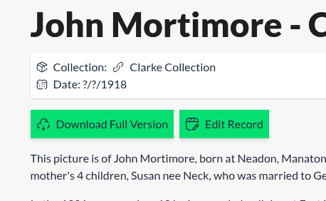

# Signing Up

To make any changes to the Archive, you need an account.

You can do this by clicking [here](https://dartmoortrust.org/auth/signup).

Once you have clicked "Register" you will be redirected to the home page. You should then see that you are logged in at the bottom of every page. If you do not see this, refresh the page.

This will create an account for you. In order to make any edits you will need to be given permission to do so. Email Jamie at jamie@dartmoortrust.org and he will do this for you.

Once permissions have been given you will see an Edit button on all of the record pages.

Clicking this will take you to the edit page where you can start your work [cataloguing](/cataloging.md)
